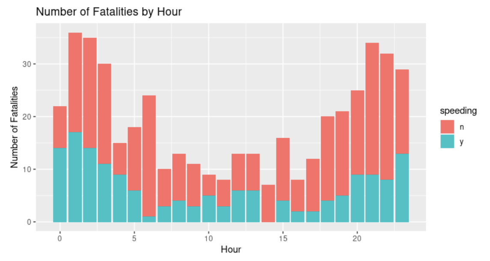

## READ ME
## Traffic Fatalities in Austin, TX 2013-2019
**Link to data:** [Results for "traffic fatalities APD" | Page 1 of 1 | Open Data | City of Austin Texas](https://data.austintexas.gov/browse?q=traffic%20fatalities%20APD&sortBy=relevance)

Welcome to the Traffic Fatalities in Austin, TX 2013-2019 project! Our mission is to delve deep into comprehensive datasets gathered by the city of Austin related to traffic violations and fatalities that took place from 2013 to 2019. 

Our goal is to explore key variables such as the lethality of the incident, type of violation, type of road being driven on, date, driver's license status, coordinate location within the city of Austin, and the time of day when these incidents occurred. By harnessing the power of data analysis and predictive modeling, our primary objective is to develop a sophisticated model that can accurately predict the likelihood of individuals being involved in a fatal accident within the city of Austin.

### Visualizations

Our early visualizations showed us that there are usually more traffic fatalities at the beginning and end of the day. We hypothesize we can find relationships between these chunks of times and factors like speeding, running red lights, and suspected impairment. Similarly, we think we will find these factors to be associated with the months that have the highest and lowest number of traffic fatalities.
Failure to stop and render aid, having a suspected impairment, and running a red light may be predictive of having more fatalities in the accident.

