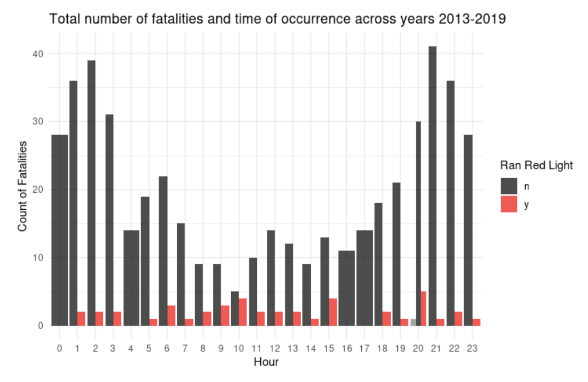
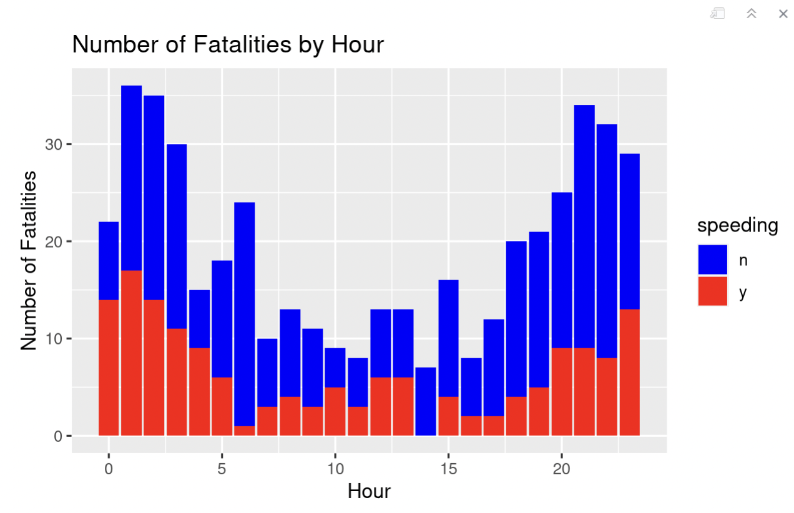

```{r, eval=FALSE}
htmltools::tagList(rmarkdown::html_dependency_font_awesome())

# Render the R Markdown document
rmarkdown::render("portfolio.Rmd", output_file = "../portfolio.html")

```


*Check out some examples of our visualizations*

<br>

<h2>Visualization 1-</h2> 

<h3> Relationship between Number of Fatalities and Time of Day </h3>


<u><strong> Hypothesis 1:</strong> </u> <br>
<b>  Null hypothesis: </b>  Drivers are just as likely to be involved in a traffic fatality at any hour of the day </p>

 <b>  Alternate hypothesis: </b>  <p> Drivers are more likely to be involved in a traffic fatality at specific hours during the day, namely late at night.</p>
 <b>  Explanation: </b> <p>     This graph supports our alternative hypothesis, and shows that early morning also is a high traffic fatality time. The speeding information is not relevant for this specific hypothesis. </p>
    
<u><strong> Hypothesis 2:</strong> </u> <br>
 <b>  Null hypothesis: </b> <p>There is no relationship between running a red light or not and the number of fatalities in the accident.
 </p>

 <b>  Alternate hypothesis: </b> <p> Accidents where a red light was run are more likely to have higher fatality counts.</p>
 <b>  Explanation: </b> <p>Our data seems to refute the alternate hypothesis we made, as well as our null hypothesis. Accidents where a red light was not run had higher fatality counts.
 </p>

<br>
<h2>Visualization 2-</h2> 
<h3> Speeding and the Average Number of Fatalities from 2013-2019</h3>

 
 
 <b>  Null hypothesis: </b> <p>The likelihood of fatality as a result of drivers who were speeding is equal to the likelihood of fatality as a result of drivers who did not speed.
 </p>

 <b>  Alternate hypothesis: </b> <p> The likelihood of fatality as a result of drivers who were speeding is greater than the likelihood of fatality as a result of drivers who did not speed.
</p>
 <b>  Explanation: </b> <p>There is not much difference and a lot of overlap with error bars between speeding and non-speeding traffic fatality occurrences. This looks in favor of the null, but we should check with more variables to see if speeding interacts with any of them.
 </p>


